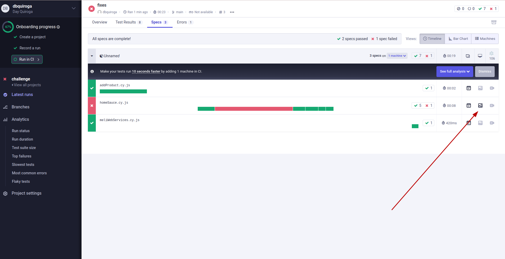

# challenge

Challenge con demo saucedemo, utilizando cypress y javascript.

# Automated Testing with Cypress and JavaScript

This repository contains an automated web testing project that interacts with saucedemo and webservice from Mercadolibre using Cypress and JavaScript.

## Pre-requisites

To get started with this project, you'll need to have the following prerequisites installed on your machine:

1. Node JS: I recommend using version 16.14.2 or newer.

## Getting Started

Install project dependencies.

```
npm i
```

## Running Tests

You can run the automated tests by using the following command:

1. Run test

```
npm test
```

2. Report in Cypress Cloud
   <br>
   2.1 Run test for reports

```
npm run cy:report
```

<br>
2.2 Go to the [Dashboard in cypress](https://cloud.cypress.io/projects/frqpqd/)

You can see the screenshoot here

## Continuous Integration (CI)

This repository has continuous integration set up using GitHub Actions. This means that the automated tests are run automatically whenever changes are pushed to the repository. You can view the results of the test runs in the "Actions" tab above. Feel free to explore the workflows and their execution details.

Additionally, you can also access the artifacts generated during the test runs, which include screenshots and videos captured during the test execution:

- **Screenshots**: Screenshots are automatically generated and stored only if an end-to-end (E2E) test fails. You can find the screenshots in the "Artifacts" section of the specific workflow run, under the "cypress-screenshots" artifact.

- **Videos**: Test run videos are always captured and stored as artifacts. You can access the test run videos in the "Artifacts" section of the workflow run, under the "cypress-videos" artifact.

## Contact

If you have any questions or have feedback, please don't hesitate to reach out to me at dbquiroga.day@gmail.com.

---

Thank you for exploring my automated testing project! Happy testing! 🚀
